# Resort Platform

Plataforma web multi-tenant para hotéis e resorts publicarem mapas interativos, locais, programação de eventos e navegação ponto a ponto para seus hóspedes.

> **Status: escopo atual implementado e em produção.**
> Os fluxos abaixo estão funcionando de ponta a ponta: portal público, painel administrativo, autenticação, upload e ativação de mapas, cadastro de locais, roteamento sobre grafo (Dijkstra), rotas sugeridas em tempo real, importação de programação via PDF + LLM com revisão humana e publicação em massa, e workflow de publicação com auditoria.

> **Código-fonte:** este é um projeto com potencial comercial em desenvolvimento. O repositório de código permanece **privado**; este repositório público existe como material de portfólio (visão de produto, arquitetura e decisões técnicas), não como o código-fonte em si.

Aprofundamento técnico (arquitetura, multi-tenancy, mapas/roteamento, pipeline de importação, estrutura do monorepo) em **[ARCHITECTURE.md](./ARCHITECTURE.md)**.

---

## Demonstração

Capturas de tela do sistema em produção — painel administrativo e portal do hóspede.

### Admin — Importação de programação via PDF + LLM

<table>
<tr>
<td width="25%">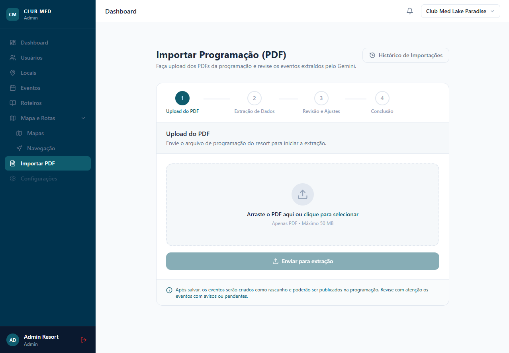</td>
<td width="25%">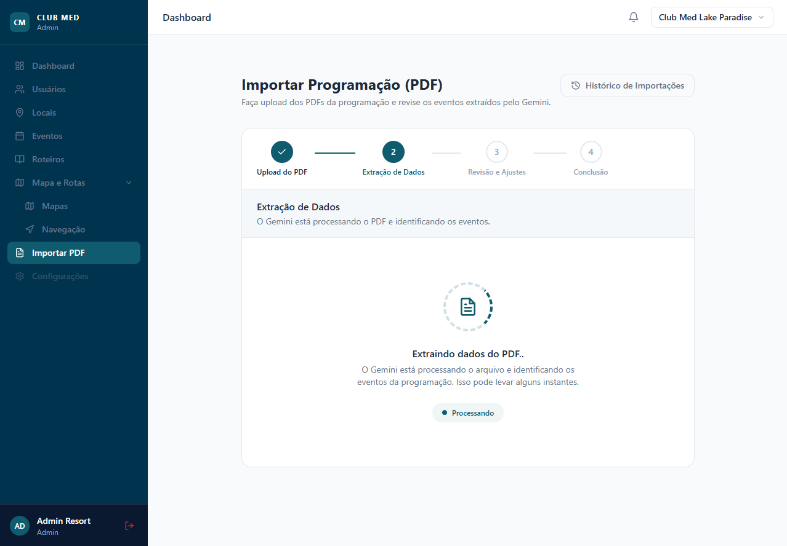</td>
<td width="25%">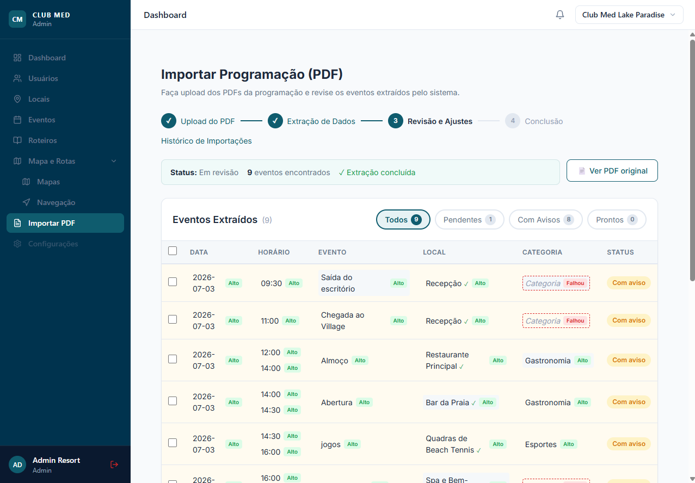</td>
<td width="25%">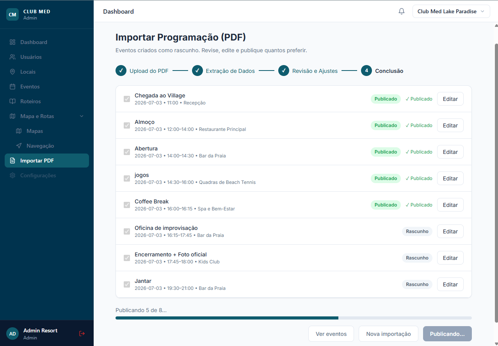</td>
</tr>
<tr>
<td align="center"><sub>Upload do PDF</sub></td>
<td align="center"><sub>Extração de eventos com llm</sub></td>
<td align="center"><sub>Revisão com nível de confiança</sub></td>
<td align="center"><sub>Edição e publicação em massa</sub></td>
</tr>
</table>

### Admin — Editor de navegação (pontos e rotas sobre o mapa)

<table>
<tr>
<td width="33%">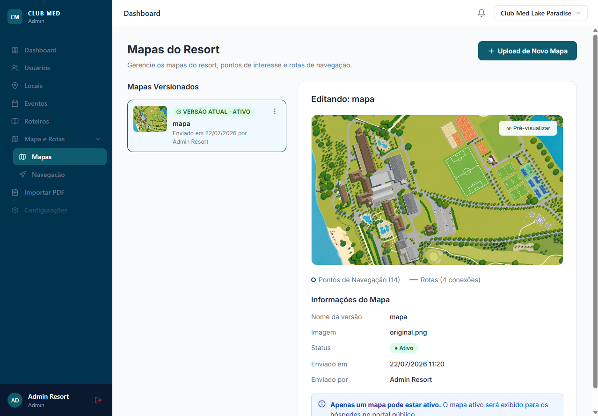</td>
<td width="33%">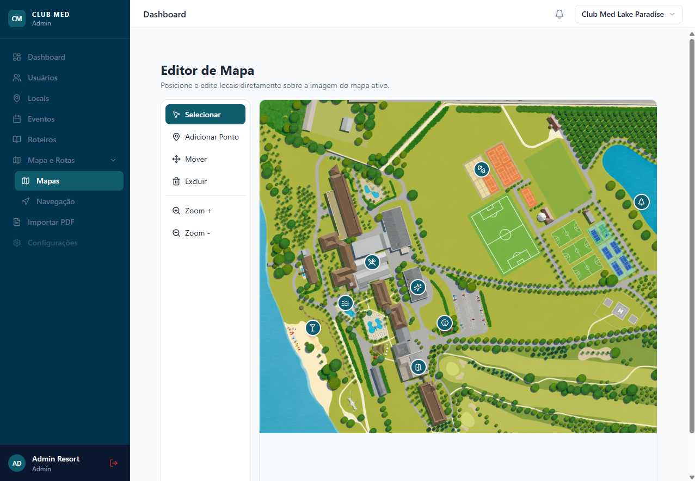</td>
<td width="33%">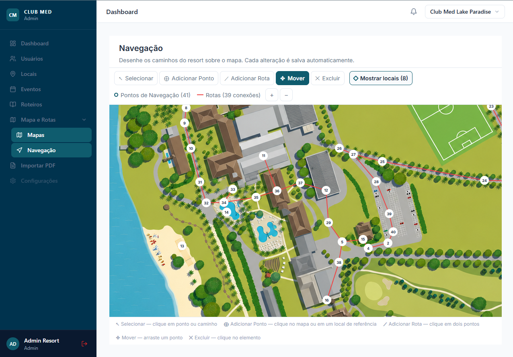</td>
</tr>
<tr>
<td align="center"><sub>Menu de mapas versionados</sub></td>
<td align="center"><sub>Edição dos pontos do mapa</sub></td>
<td align="center"><sub>Edição de navegação</sub></td>
</tr>
</table>

### Portal público — Mapa, rotas e roteiros

<table>
<tr>
<td width="25%">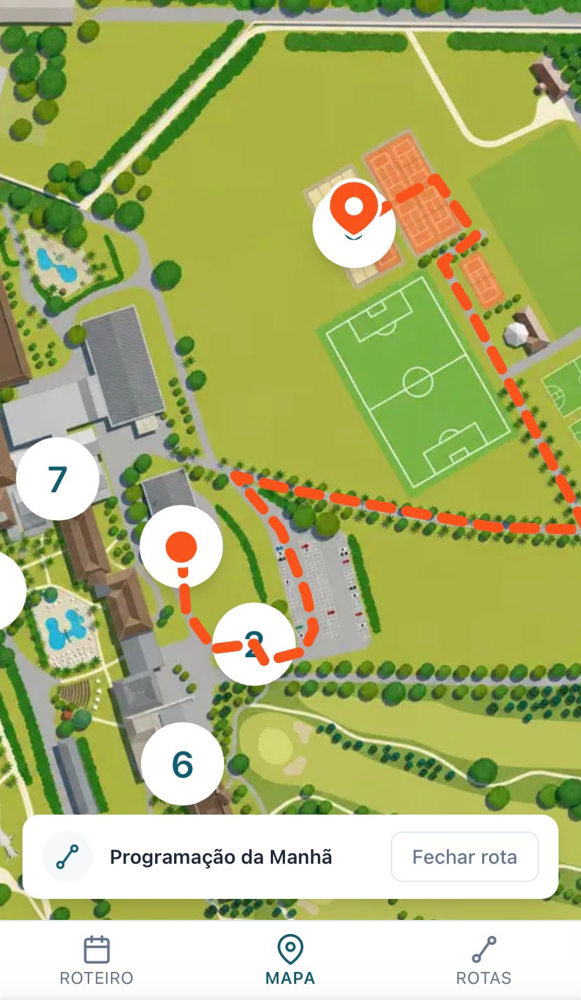</td>
<td width="25%">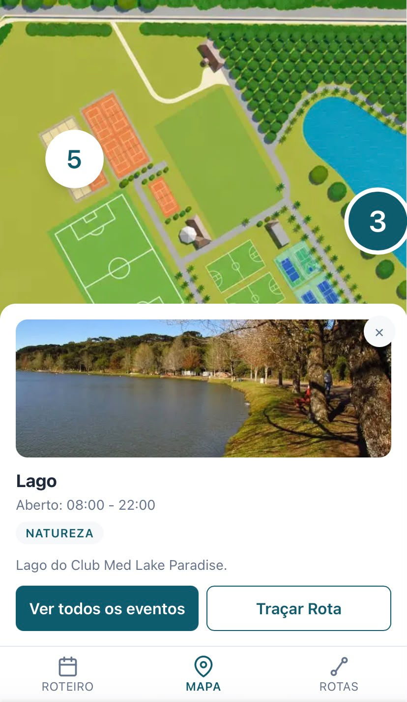</td>
<td width="25%">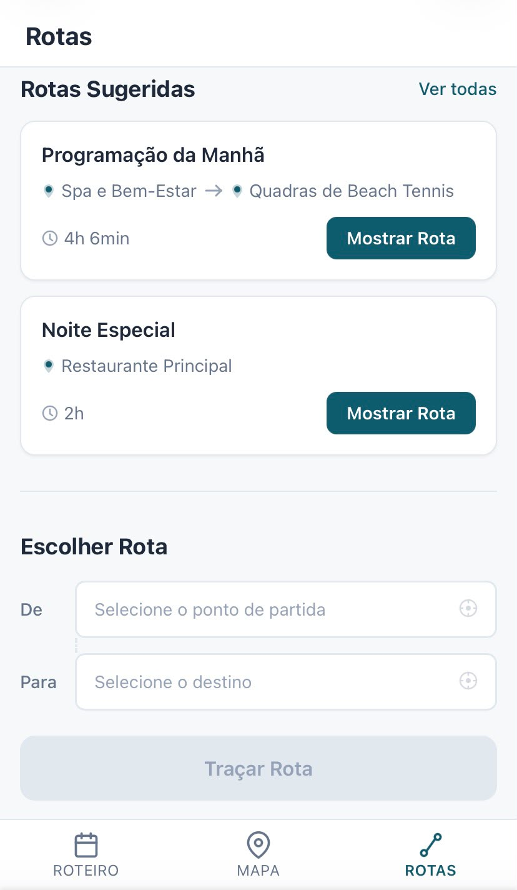</td>
<td width="25%">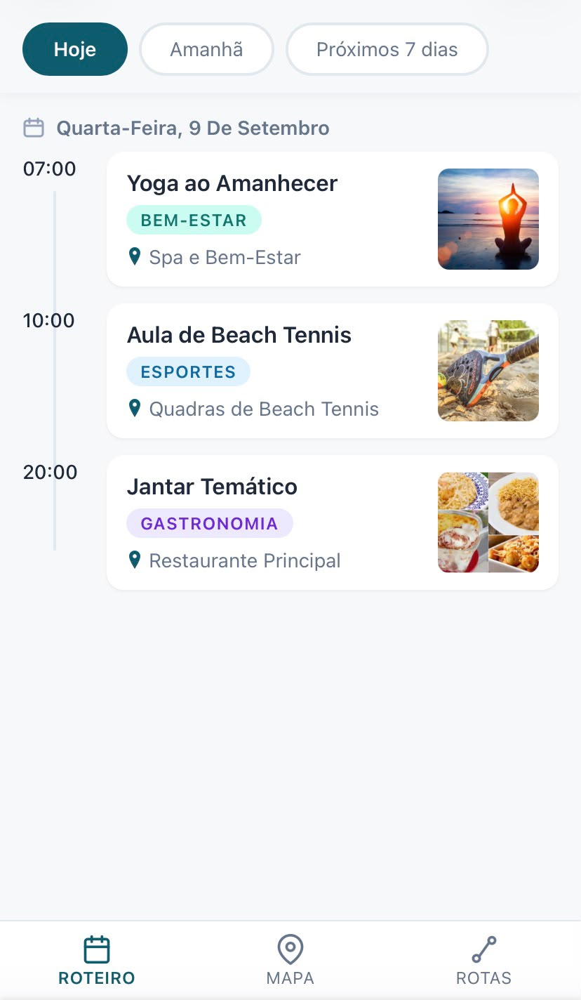</td>
</tr>
<tr>
<td align="center"><sub>Rota calculada entre dois pontos</sub></td>
<td align="center"><sub>Detalhe de um local selecionado</sub></td>
<td align="center"><sub>Rotas sugeridas em tempo real</sub></td>
<td align="center"><sub>Roteiros do dia</sub></td>
</tr>
</table>

---

## O problema

Hotéis e resorts que têm programação semanal ou recorrente de eventos (aulas, atividades, shows) normalmente lidam com isso de duas formas manuais: um PDF estático que o hóspede baixa e nunca mais olha, ou a atualização manual, evento por evento, de alguma ferramenta genérica — trabalho repetitivo toda vez que a programação muda.

O Resort Platform resolve isso com foco em dois pontos:

- **Extração assistida por IA**: o funcionário sobe o PDF de programação que o hotel já produz internamente, e o sistema extrai os eventos automaticamente — sem digitação manual evento por evento. Nada é publicado sem revisão humana.
- **Rotas desenhadas sobre o mapa real do hotel**: diferente de soluções prontas de mapa genérico, o portal admin permite desenhar, diretamente sobre a imagem do mapa ativo do resort, a malha real de caminhos internos. O portal público então calcula rotas reais sobre essa malha — nunca linha reta, nunca dependente de GPS ou de provedores externos de mapa.

---

## Funcionalidades

| Área | O que faz |
|---|---|
| **Multi-tenant** | Cada hotel é isolado por `hotelId` em toda entidade do sistema; hotel de outro tenant nunca é revelado — retorna 404, nunca 403, mesmo quando o recurso existe em outro hotel. Detalhado em [ARCHITECTURE.md](./ARCHITECTURE.md#multi-tenancy-e-isolamento). |
| **Autenticação (Admin)** | Auth.js (Credentials Provider), hash bcrypt, sessão JWT, middleware de perímetro + revalidação em cada Route Handler/Server Component (defesa em profundidade). |
| **Roles (ADMIN / EDITOR)** | O modelo de domínio já prevê duas roles e um perfil `EDITOR` pode ser criado normalmente. O fluxo completo de `ADMIN` está implementado e em uso; o conjunto de permissões específicas de `EDITOR` ainda está em definição (ver [Melhorias futuras](#melhorias-futuras)). |
| **Mapas** | Upload versionado de imagem (Cloudinary), histórico de versões, ativação com transação atômica (apenas um mapa `ACTIVE` por hotel). |
| **Locais** | CRUD com categoria fechada (enum de 14 valores), posicionamento visual sobre o mapa via coordenadas normalizadas (`0.0`–`1.0`, independentes de resolução de tela). |
| **Eventos** | CRUD com categoria em texto livre (sem enum — decisão de domínio deliberada), vínculo obrigatório a um Local. |
| **Roteiros (Itinerary)** | Agrupamento de eventos já publicados sob um título, para organização interna no Admin. |
| **Navegação por grafo** | Editor visual onde o funcionário cria pontos e caminhos sobre o mapa; termos técnicos nunca aparecem na UI. Detalhado em [ARCHITECTURE.md](./ARCHITECTURE.md#mapas-e-roteamento). |
| **Roteamento (Dijkstra)** | Cálculo de menor caminho entre dois locais sobre a malha cadastrada. Reutilizado tanto pelo cálculo manual de rota no portal público quanto pelo preview do Admin. |
| **Rotas sugeridas** | Agrupamento de eventos publicados do dia por proximidade de horário/local, calculado em tempo real a cada requisição — nunca persistido no banco. |
| **Importação de PDF via LLM** | Upload → extração estruturada por LLM → revisão manual → confirmação → edição individual dos eventos criados → **publicação em massa** dos selecionados. Pipeline completo em [ARCHITECTURE.md](./ARCHITECTURE.md#pipeline-de-importação-de-pdf-llm--revisão-humana--publicação-em-massa). |
| **Workflow de publicação** | Máquina de estados estritamente linear `Draft → Published → Archived` (sem reativação, sem pular etapa), execução exclusiva de `ADMIN`. |
| **Auditoria** | Log de mutações relevantes (quem, quando, o quê mudou) consultável por entidade e como feed de atividade recente no dashboard. |
| **Deploy separado** | `apps/public` e `apps/admin` como aplicações Next.js independentes, com deploy próprio na Vercel, compartilhando banco e camada de regras de negócio via packages internos do monorepo. |

---

## Stack

| Camada | Tecnologia |
|---|---|
| Frontend | Next.js (App Router) + TypeScript + Tailwind CSS + shadcn/ui |
| Autenticação | Auth.js (Credentials Provider) + bcrypt |
| Validação / contratos | Zod — schemas como fonte única de verdade para validação em runtime e tipos em build-time (`z.infer`) |
| Banco de dados | PostgreSQL |
| ORM | Prisma |
| Storage de arquivos | Cloudinary (mapas, imagens de local, PDFs) |
| Extração de PDF | LLM externo via adapter próprio (`<confirmar provedor em uso>`) |
| Monorepo | Turborepo |
| Deploy | Vercel (apps independentes) + Neon (Postgres) |

---

## Infraestrutura e deploy

```
apps/public   ──▶ Vercel (projeto próprio)
apps/admin    ──▶ Vercel (projeto próprio)
PostgreSQL    ──▶ Neon
Arquivos      ──▶ Cloudinary
```

As duas aplicações Next.js são deployadas como projetos Vercel independentes, cada uma com seu próprio ciclo de deploy — um problema de build ou runtime em uma não afeta a outra. Ambas apontam para a mesma connection string do Postgres (Neon) e compartilham a mesma lógica de negócio via `packages/api`, evitando duplicação de regra entre os dois portais. Detalhes de arquitetura em [ARCHITECTURE.md](./ARCHITECTURE.md).

---

## Acesso ao código-fonte

O código-fonte completo (monorepo Turborepo, os dois apps Next.js e os três packages internos) está em um repositório privado, por se tratar de um projeto com potencial comercial ainda em desenvolvimento.

Este repositório público concentra a documentação de produto/arquitetura, os diagramas e as capturas de tela do sistema em produção — suficiente para avaliar as decisões técnicas sem expor a implementação completa.

---

## Metodologia de desenvolvimento

O projeto foi desenvolvido seguindo uma abordagem de Spec-Driven Development (SDD), utilizando IA como ferramenta de desenvolvimento e validação ao longo de todas as camadas — da especificação de arquitetura e domínio até a implementação de services, rotas e componentes.

Na prática, isso significou: escrever primeiro um conjunto de contratos (arquitetura do monorepo, modelo de domínio, schema de banco, DTOs, permissões, workflow de publicação, contratos de API), auditar esses documentos entre si em busca de inconsistências antes de gerar qualquer código, e então implementar cada camada a partir desses contratos já fechados — sempre com rastreabilidade de qual decisão vem de qual documento.

Isso não substitui entendimento de arquitetura, decisões de trade-off ou responsabilidade sobre o resultado — apenas mudou onde o tempo foi investido: mais na definição precisa de contratos e menos em código boilerplate repetitivo.

O processo gerou um conjunto extenso de especificações (arquitetura, modelo de domínio, schema de banco, DTOs, permissões, workflow de publicação, contratos de API) que funcionaram como fonte única de verdade durante a implementação. Essas specs não foram versionadas como arquivos no repositório — foram mantidas como contexto de projeto dentro da própria ferramenta de IA usada no desenvolvimento (Claude), servindo como referência viva consultada a cada nova etapa de implementação. O resumo de arquitetura e decisões apresentado em [ARCHITECTURE.md](./ARCHITECTURE.md) é o recorte pensado para ser público.

---

## Melhorias futuras

Itens conhecidos que ficaram fora do escopo atual, deliberadamente ou por ainda estarem em decisão:

- **Permissões completas de `EDITOR`**: o perfil já existe no domínio e pode ser criado normalmente, mas o conjunto exato de operações permitidas a ele (o que pode e o que não pode fazer em relação a `ADMIN`) ainda está em definição. Hoje, na prática, apenas `ADMIN` é usado de ponta a ponta.
- **Republicação de roteiros recorrentes**: hoje `Itinerary` serve apenas para organização interna — agrupar eventos já publicados sob um título. A ideia original, ainda não implementada, é permitir republicar um roteiro inteiro alterando apenas as datas, evitando que o funcionário precise reimportar o mesmo PDF toda semana para programações que se repetem com frequência.
- **Cadastro de usuários pelo Admin**: ainda não existe uma tela de criação de usuário na aplicação. Os usuários atuais foram criados via seed, apenas para viabilizar a demonstração/uso da aplicação.

---

## Limitações conhecidas

- Sem suíte de testes automatizados no estado atual do projeto.
- Sem CI/CD.
- Workflow de publicação não permite reativar conteúdo arquivado.
- Sem fluxo de recuperação de senha (Admin) — redefinição é manual, feita por outro `ADMIN`.

---

